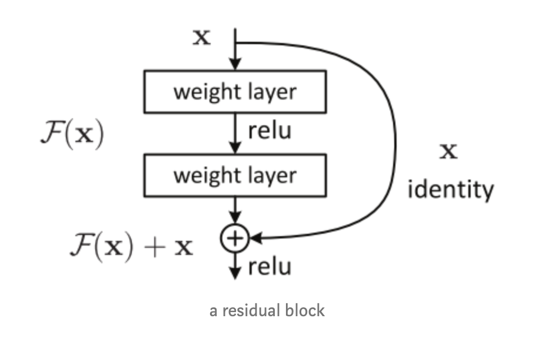
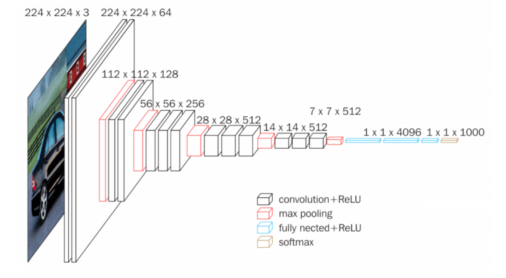

# Modeling Summary

**Xuzhen Xiang**


## Data Loading

After preprocessing step, we obtained training, validating, testing datasets with corresponding image metadata (i.e. image urls, landmark ID, image ID). Based on these metadata, we were able to split chosen data into `train`, `test`, and `validation` directories using python `shutil` library.

Due to the monstrous size of our dataset, it is infeasible to load all the images at once during training. One of the ideal methods would be to load the dataset on multiple cores in real time and feed it right away our models. Luckily, Keras, a high-level neural networks API, provides a  `ImageDataGenerator` class with functions that storing knowledge gained while solving one problem and applying it to a different but related problem


## Transfer Learning

Training a deep neural network on such big dataset from scratch is both time and resources consuming. Instead, we decided to adopt transfer learning method by using a pretrained ConvNet either as an initialization or a fixed feature extractor for the task of interest. 

After doing some research about the LSVRC (large scale vision recognition challenge), we chose to use pre-trained weights and structures of  VGG16 and ResNet50, both achieving high accuracy after training on ImageNet, the dataset containing 1.2 million images with 1000 categories.


## ResNet

Vanishing gradient is one of the difficulties faced by very deep neural networks. When implementing back-propagations on deep neural networks, we repeatedly mutiply the gradient of early layers, resulting in a very small gradient and thus, making the learning improvement extremely slow. ResNet, one of the most groundbreaking models, provides a method that allows us to train a very deep neural network but still achieve a good performance. The core idea for solving vanishing gradient is to use a "residual block" which  stack identity mappings (layer that doesn’t do anything) upon the current network and the resulting would perform the same. The structure for a residual block is shown in the figure below. 



## VGGNet

VGGNet is trying to investigate the effect of the convolutional network depth on its accuracy in the large-scale image recognition setting which suits perfect with our taks (image dataset with more than 1 million images and 1000 classes). The great improvement over AlexNet was achieved by replacing large kernel-sized  filters (11 and 5 in the first and second convolutional layer,  respectively) with multiple 3×3 kernel-sized filters one after another. The structure of VGGNet is shown below. 




## Modeling Procedure

We structured our modeling procedure in three main stages.

- **Stage 1: Testing, debugging the basic pipeline of the model.**

  In this stage, we started with a relatively small dataset and fed the dataset into LeNet-5, a very basic and light-weighted ConNet. By building a custom data generator, we randomly sampled images from each class and loaded batches of those images during training. The purpose for this stage is to assure that

  - the loading process is correct
  - size of images (128x128x3) corresponds with the size set in the input layer
  - all the methods in the pipline were used correctly. 

- **Stage 2: Training without Data Augmentation**

  In this stage, we created a `imageDataGenerator` object without setting or passing any parameters, which means we were going to use original images for training. Then we use `flow_from_directory` and `fit_generator` for loading batches of image data from corresponding directory during training. We built up using two pretrained models in this stage, VGG_16 and ResNet_50. Since the input size of our data is different from the data in ImageNet, we did not include the top layers in VGG and ResNet. 

  

  For VGG_16, we added Global Average Pooling Layer and a fully connected layer with softmax as the activation fucntion at the end. Hyperparmeters for training were set to:

  - number of epochs: 8
  - batch_size: 128
  - optimizer: Adam with learning rate = 0.0001

  We intialized weights with the weights trained on ImageNet. We started by freezing five layers and making the other layer trainable but the result was not satisfying. We experiemented with two layer freezed which showed a slightly quicker improvement in training loss during early epochs. 

  

  For ResNet_50, we only added the final fully connected layer with softmax as the activation fucntion at the end. We started with froze five layers but the validation accuracy was quite low. After setting all the layers trainable, we observed a relatively decent result produced by ResNet. Since setting learning rate as 1e-4 worked well on VGG16, we started our experiement on ResNet50 with the same learning rate. But we observed that ResNet with a constant learning rate equal to 1e-4 passed the lowest loss with very few epochs. Thus, instead of using a constant learning rate, we performed a learning rate decay which halved the learning rate at 5th epoch and halved it again at 7th epoch. The other hyperparameters were stay unchanged. 

  

- **Stage 3: Training with Data Augmentation**

  In this stage, we added data augmentation to make our model more robust. `Data augmentation increases the size of the training dataset by creating new images with different variations of current image data. For example, new images can be generated from original images by cropping, flipping , random rotations, etc. In our model, we generated new data by:

  - rotation_range 
  - width_shift_range
  - height_shift_range
  - zoom

  All the parameters of these transformations were passed into `ImageDataGenerator` object. With `flow_from_directory` ,  `ImageDataGenerator` loaded the data from specific directory and perform real-time data augmentation during training. 

  Only ResNet was used in this stage. We still used the imageNet weights and made all the layers trainable. In Stage 2, We still observed an obvious oscillation of the validation loss starting in 3rd epoch, which motivated us to refine the learning rate decay function. We applied Step Decay function which is defined as 

  ```
  next_learning_rate = current_learning_rate*(decay_factor**floor(epoch/step_Size))
  ```
  
  Learning rate was intialized as 1e-4. Decay_factor and step_size were set tp 0.75 and 2. The other hyperparameters were stay unchanged. 


The whole training process in stage 2 and 3 took place on Google Cloud Platform. A 8-CPUs, 30 GB virtual machine was used together with a NVIDIA Tesla 100P GPU. The average training time for all the models in stage 2 and 3 is around 3.5 hours for total 8 epochs. 